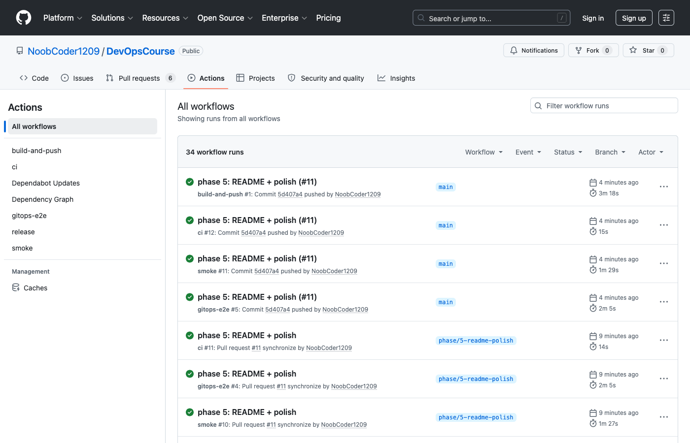
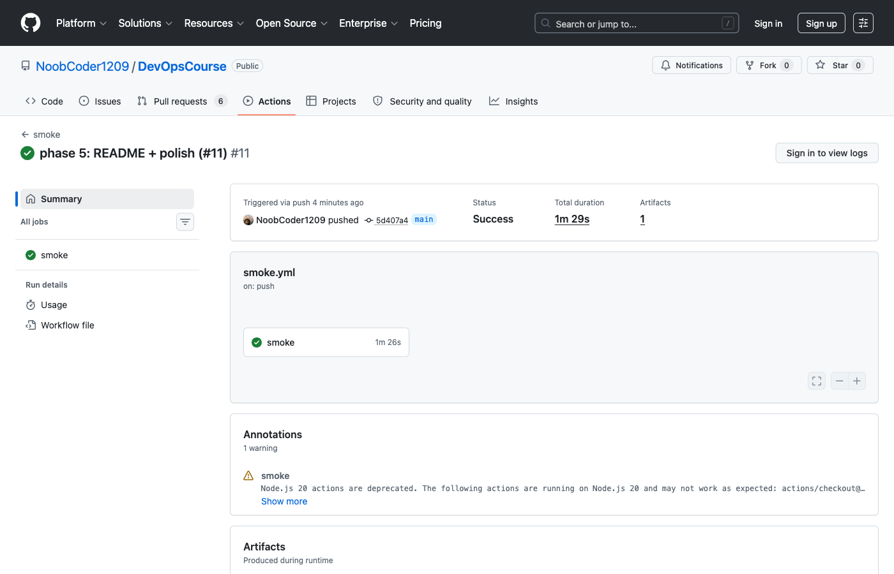
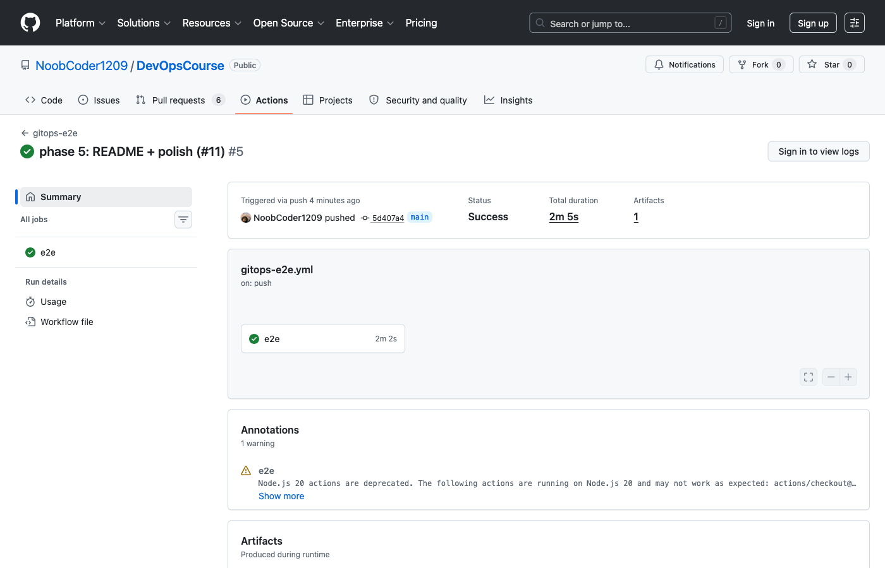
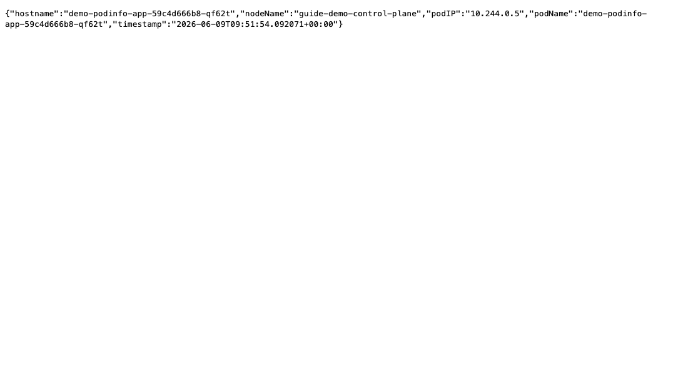
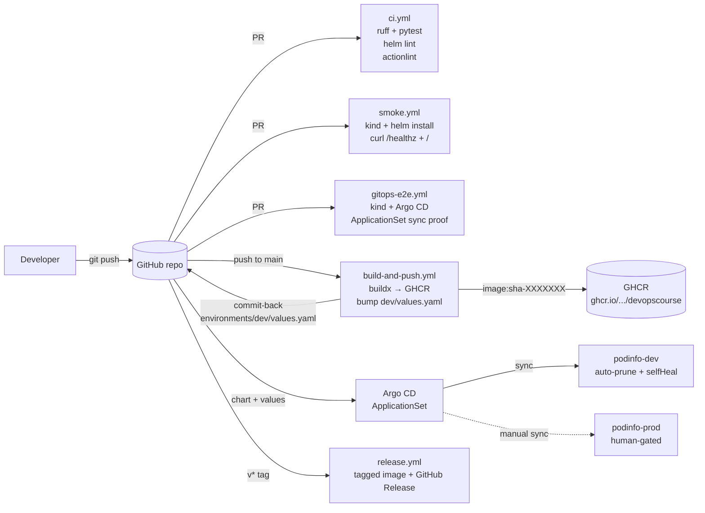

# DevOpsCourse

[](https://github.com/NoobCoder1209/DevOpsCourse/actions/workflows/ci.yml)
[](https://github.com/NoobCoder1209/DevOpsCourse/actions/workflows/smoke.yml)
[](https://github.com/NoobCoder1209/DevOpsCourse/actions/workflows/gitops-e2e.yml)
[](LICENSE)

End-to-end DevOps reference: a tiny Flask app, a multi-stage Docker image, a Helm chart, GitHub Actions CI/CD, a kind smoke test, and an Argo CD ApplicationSet GitOps loop — all wired together so a code change rolls all the way to a deployed pod via pull-based reconciliation.

The app itself is intentionally trivial (it returns the pod's identity from the Kubernetes Downward API). The point is the **pipeline shape**, not the business logic.

## Demo

| `ci` + `smoke` + `gitops-e2e` all green on main | `smoke.yml` — kind cluster, helm install, curl /healthz | `gitops-e2e.yml` — Argo CD reconciles the chart from the PR ref |
| --- | --- | --- |
|  |  |  |

Browser view of `/` returning the live K8s Downward API payload from a kind cluster:



For a step-by-step walkthrough of running the demo locally, see [`guide.md`](guide.md).

## Architecture



## What this demonstrates

- **CI/CD** — five GitHub Actions workflows: lint+test, image build+push, kind smoke, full GitOps e2e, and tagged release.
- **Containers** — multi-stage Dockerfile, non-root UID 10001, urllib healthcheck (no curl in the runtime image), gunicorn 23.
- **Kubernetes** — Helm chart with Downward API env wiring, PSS-restricted securityContext, `/healthz` probes, named ports, `helm test` hook.
- **GitOps** — `argocd/applicationset.yaml` with a list generator over dev + prod and `templatePatch` for typed-field substitution; the build workflow rewrites the dev image tag and commits back so Argo picks up the change without a separate trigger.
- **Production hygiene** — global JSON error handler (no tracebacks ever in HTTP bodies), `request_id` correlation between client and server logs, `automountServiceAccountToken: false`, sha256-pinned `yq` downloads, dependabot on actions / pip / docker.

## Quick start

### 1. Local dev (no cluster)

```bash
docker compose up --build
curl -s http://localhost:8000/ | jq .
curl -s http://localhost:8000/healthz
```

### 2. Run the test suite

```bash
python3.12 -m venv .venv && source .venv/bin/activate
pip install -r requirements-dev.txt
ruff check . && pytest -q
```

10 tests, 100% line coverage on the `app/` package.

### 3. End-to-end on a kind cluster

```bash
# Build + load locally:
docker build -t podinfo-app:dev .
kind create cluster --name podinfo
kind load docker-image podinfo-app:dev --name podinfo

# Install via Helm:
helm install demo chart/ \
  --set image.repository=podinfo-app \
  --set image.tag=dev \
  --set image.pullPolicy=Never \
  --wait

# Hit it:
kubectl port-forward svc/demo-podinfo-app 8000:80
curl -s http://localhost:8000/ | jq .

# helm test:
helm test demo --logs
```

### 4. With Argo CD (real GitOps)

See [`argocd/README.md`](argocd/README.md) for the install + apply recipe. The `gitops-e2e.yml` workflow does this end-to-end on every PR that touches `chart/`, `environments/`, or `argocd/`.

## Repo layout

```
.
├── app/                 # Flask app: routes, podinfo, error handler
├── tests/               # pytest, 100% coverage
├── chart/               # Helm chart (deployment, service, helm-test pod)
├── environments/
│   ├── dev/values.yaml  # CI rewrites image.tag on every merge to main
│   └── prod/values.yaml # human-pinned, only release.yml touches it
├── argocd/              # ApplicationSet + standalone Applications
├── .github/workflows/   # 5 workflows: ci, build-and-push, smoke, gitops-e2e, release
├── Dockerfile           # multi-stage, non-root, urllib healthcheck
└── docker-compose.yml   # local dev with init: true and matching healthcheck
```

## CI matrix

| Workflow | Trigger | Purpose | Timeout |
| --- | --- | --- | --- |
| `ci.yml` | PR + push to main | ruff + pytest + helm lint + actionlint | 8 min |
| `build-and-push.yml` | push to main (paths-filtered) | build + push to GHCR, bump dev image tag commit-back | 15 min |
| `smoke.yml` | PR + push to main | kind + helm install + curl /healthz + /, helm test | 12 min |
| `gitops-e2e.yml` | PR + push to main (paths-filtered) | kind + Argo CD + ApplicationSet sync proof | 20 min |
| `release.yml` | `v*` tag | tagged image push + GitHub Release | 12 min |

## Skills demonstrated

DevOps · CI/CD · Kubernetes · Helm · Docker · GitHub Actions · GitOps · Argo CD · Python · Flask · pytest · ruff

## License

MIT — see [LICENSE](LICENSE).
